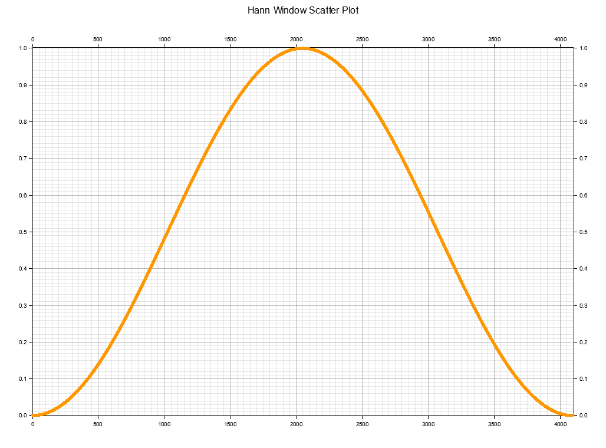

# hann-rs (Hann Window)
This crate provides functions for computing the Hann window, a function used to taper the edges of a signal window to reduce spectral leakage. The Hann window is defined by the formula `w(n) = 0.5 - 0.5 * cos(2π * n / (N - 1))`, where n is the index of the current sample and `N` is the length of the window.



A lookup table for pre-computed Hann windows is provided for common window lengths. This improves performance for repeated calculations with the same window length.

## Usage
1. Import the crate:

```toml
[dependencies]
hann-rs = "0.1.0"
```

```rust
use hann_rs::get_hann_window;
```

2. Get a Hann window of a specific length using the `get_hann_window` function:

```rust
let window_length = 1024;
let hann_window = get_hann_window(window_length).expect("Failed to get the Hann window");
```
If the desired window length is in the lookup table, the precomputed values will be returned. If not, the Hann window values will be computed.

### Precomputed Lookup Table
The lookup table, `HANN_WINDOW_LOOKUP_TABLE`, contains precomputed Hann windows of lengths 256, 512, 1024, 2048, and 4096.

You can add or modify the precomputed window lengths by changing the `HANN_WINDOW_PRECOMPUTED_LENGTHS` array in the `lazy_static` block:

```rust
const HANN_WINDOW_PRECOMPUTED_LENGTHS: [usize; 5] = [256, 512, 1024, 2048, 4096];
```
## Error Handling
The functions `get_hann_window` return a `Result<Vec<f32>, HannWindowError>` type. Errors are returned in the following cases:


- The window length is less than or equal to 1.
- The window length is greater than the allowed maximum.
- Memory allocation errors due to a large window length.

To handle these errors, use the `Result` type as follows:

```rust
match get_hann_window(window_length) {
    Ok(hann_window) => {
        // Use the Hann window
    },
    Err(error) => {
        println!("Error getting the Hann window: {:?}", error);
        // or handle the error in your way
    },
}
```

### Benchmarks of **APPROXIMATE** results

|Metric  | Size | Minimum Time  | Average Time  | Maximum Time  |
:-------:|-----:|------------------:|------------------:|------------------:|
`get_hann_window` | 2000 WL  | 7.0252 (µs) | 7.0657 (µs) | 7.1153 (µs) |
`get_hann_window` | 4000 WL  | 13.496 (µs) | 13.596 (µs)| 13.708 (µs) |
`get_hann_window` (Cached) | 4096 WL  | 363.84 (ns) | 369.98 (ns) | 377.30 (ns) | 


# hann-rs (Hann Window Sum of Squares)
This module provides functions for computing the sum of squares of a Hann window. It utilizes a lookup table for pre-computed sum of squares for common Hann window lengths, improving performance for repeated calculations with the same window length.

## Usage
1. Import the module:

```rust
use hann_rs::get_hann_window_sum_squares;
```

2. Get the sum of squares of a Hann window using the `get_hann_window_sum_squares` function:

```rust
let hann_window: Vec<f32> = vec![...]; // The Hann window values
let hann_window_sum_squares = get_hann_window_sum_squares(&hann_window);
```

If the length of the input `hann_window` is in the lookup table, the precomputed value will be returned. If not, the sum of squares will be computed using `map` and `sum`.

### Precomputed Lookup Table
The lookup table, `HANN_WINDOW_SUM_OF_SQUARES`, contains precomputed sum of squares for Hann windows of lengths 256, 512, 1024, 2048, and 4096.

You can add or modify the precomputed window lengths by changing the `HANN_WINDOW_PRECOMPUTED_LENGTHS` array in the `lazy_static` block:

```rust
const HANN_WINDOW_PRECOMPUTED_LENGTHS: [usize; 5] = [256, 512, 1024, 2048, 4096];
```

### Benchmarks of **APPROXIMATE** results

|Metric  | Size | Minimum Time  | Average Time  | Maximum Time  |
:-------:|-----:|------------------:|------------------:|------------------:|
`get_hann_window_sum_squares` | 2000 WL |  601.14 (ns) | 603.21 (ns) | 605.71 (ns) |
`get_hann_window_sum_squares` | 4000 WL |  1.1465 (µs)| 1.1520 (µs) | 1.1588 (µs) |
`get_hann_window_sum_squares` (Cached) | 4096 WL  | 10.583 (ns) | 10.628 (ns) | 10.680 (ns) |
