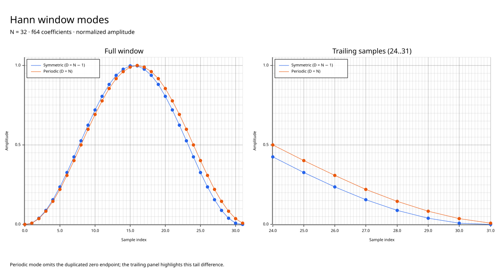

# hann-rs

Generate Hann windows and their energy in `f32` or `f64`.

[API documentation](https://docs.rs/hann-rs) · [Changelog](./CHANGELOG.md)

Hann windows taper sampled signals to reduce spectral leakage:

`w(n) = 0.5 - 0.5 cos(2πn / D)`

`D` depends on the selected [`HannMode`](https://docs.rs/hann-rs/latest/hann_rs/enum.HannMode.html):

| Mode | Denominator | Typical use |
| --- | --- | --- |
| `Symmetric` | `N - 1` | Filter design; both endpoints are zero |
| `Periodic` | `N` | Spectral analysis; no duplicated endpoint |



This SVG is generated from the public `hann_f64` API. Regenerate it with:

```console
cargo run --example generate_plot
```

## Installation

```toml
[dependencies]
hann-rs = "0.2"
```

hann-rs 0.2 requires Rust 1.98 or newer.

## Usage

Allocate a window:

```rust
use hann_rs::{HannMode, hann_f32};

let window = hann_f32(1024, HannMode::Periodic);
assert_eq!(window.len(), 1024);
```

Reuse generated windows with a caller-owned cache:

```rust
use hann_rs::{HannCacheF32, HannMode};

let mut cache = HannCacheF32::new();
let window = cache.get(1024, HannMode::Periodic);
assert_eq!(window.len(), 1024);
```

Cache entries are retained by `(length, mode)` until `clear` or cache drop.
`get` mutably borrows the cache and returns a borrowed slice, so finish using
one slice before requesting another window. Keep one cache per workload and
clear it when retained lengths or modes are no longer needed.

Fill an existing buffer without allocating:

```rust
use hann_rs::{HannMode, hann_in_place_f64};

let mut window = [42.0; 5];
hann_in_place_f64(&mut window, HannMode::Symmetric);
assert_eq!(window[0], 0.0);
assert_eq!(window[0], window[4]);
assert_eq!(window[1], window[3]);
```

Compute the sum of squared coefficients without generating a window:

```rust
use hann_rs::{HannMode, hann_energy_f32};

assert_eq!(hann_energy_f32(5, HannMode::Symmetric), 1.5);
```

## API

| Operation | `f32` | `f64` |
| --- | --- | --- |
| Fill a buffer | `hann_in_place_f32` | `hann_in_place_f64` |
| Allocate a `Vec` | `hann_f32` | `hann_f64` |
| Compute energy | `hann_energy_f32` | `hann_energy_f64` |
| Cache windows | `HannCacheF32` | `HannCacheF64` |

All functions define the same boundary behavior:

- Length 0 produces an empty window or no-op and has energy 0.
- Length 1 produces `[1.0]` and has energy 1.

The allocating and cache APIs impose no maximum length. Validate
caller-controlled lengths before calling them; impossible or failed allocations
may panic or abort.

The in-place functions allocate no memory. The `Vec` functions allocate their
result once and delegate generation to the corresponding in-place function.
Energy functions use closed forms and allocate no memory.
The benchmark suite measures generation and warmed caller-owned cache hits for
both precisions. Run it on target hardware before making performance decisions.

## Benchmarks

### Current periodic generation

`cargo bench` measures 4,096-sample periodic windows:

| Benchmark | Lower | Estimate | Upper |
| --- | ---: | ---: | ---: |
| `hann_f32/in_place` | 12.080 µs | 12.091 µs | 12.105 µs |
| `hann_f32/allocating` | 12.158 µs | 12.164 µs | 12.170 µs |
| `hann_f32/cached_hit` | 9.8947 ns | 9.9105 ns | 9.9269 ns |
| `hann_f64/in_place` | 22.162 µs | 22.193 µs | 22.225 µs |
| `hann_f64/allocating` | 22.389 µs | 22.422 µs | 22.457 µs |
| `hann_f64/cached_hit` | 10.200 ns | 10.218 ns | 10.240 ns |

### Legacy comparison

The comparison group matches the legacy benchmark's 4,096-sample `f32`
**symmetric** window. Return ownership matters: legacy 0.1.0 cloned its global
cache entry into an owned `Vec`; the new cache normally returns a borrowed
slice.

| Implementation | Cache behavior | Return | Lower | Estimate | Upper |
| --- | --- | --- | ---: | ---: | ---: |
| Legacy 0.1.0 `get_hann_window` | Global hit | Owned clone | 395.46 ns | 407.29 ns | 420.10 ns |
| 0.2 `uncached_symmetric` | No cache | Owned generation | 15.693 µs | 16.258 µs | 16.848 µs |
| 0.2 `cached_symmetric_borrowed` | Caller-owned hit | Borrowed slice | 29.738 ns | 30.300 ns | 30.919 ns |
| 0.2 `cached_symmetric_owned_clone` | Caller-owned hit | Owned clone | 452.36 ns | 460.91 ns | 469.84 ns |

On this run, the normal borrowed cache hit was 13.4× faster than legacy.
For ownership-equivalent cloned output, 0.2 was 13.2% slower than legacy.
Uncached generation was 39.9× slower than legacy's cache hit.

Run the current comparison with:

```console
cargo bench --bench bench -- legacy_comparison
```

The legacy row came from unchanged commit `0c92550` using:

```console
cargo bench --bench bench -- get_hann_window
```

Environment: 13th Gen Intel Core i7-13700H, Linux x86_64, Rust 1.98.0,
measured 2026-08-31. Current benchmarks use Criterion 0.8.2; legacy uses its
original Criterion 0.4.0. Values are Criterion confidence intervals from one
run each. Results include outliers and are not a performance guarantee; rerun
on target hardware.

## License

MIT
